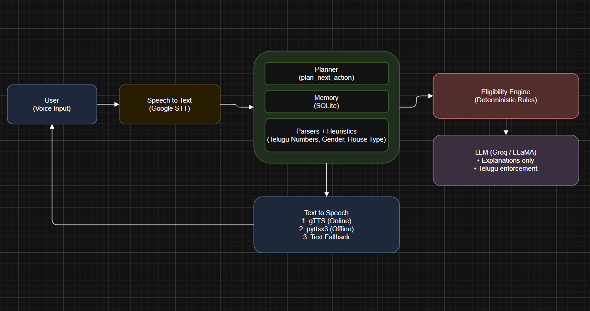

# Agentic Voice AI for Government Schemes

This repository contains an agentic, voice-first AI assistant that helps users identify and apply for eligible Indian government schemes using Telugu speech.

Repository: Agentic_voice_AI

---

##  Overview
The system supports multi-turn voice interaction, deterministic eligibility checking, memory-based reasoning, and robust failure recovery.  
It is designed to handle real-world speech ambiguity in Telugu.

---

##  Key Features
- Telugu voice interaction (Speech-to-Text + Text-to-Speech)
- Agentic planning with explicit state transitions
- SQLite-based conversational memory
- Deterministic eligibility engine (no hallucinations)
- Domain-specific speech parsing and heuristics
- Hybrid Text-to-Speech with offline fallback
- Graceful recovery from STT and parsing failures

---

##  Architecture



**Core Components:**
- Speech-to-Text: Google STT
- Agent Core:
  - Planner (decision making)
  - Memory (SQLite)
  - Parsers & heuristics
- Eligibility Engine (rule-based)
- LLM (Groq / LLaMA): explanations only
- Text-to-Speech:
  1. gTTS (online)
  2. pyttsx3 (offline)
  3. Text fallback


See `docs/architecture.png` for the system diagram.

---

##  Setup Instructions

## How to Run (Any PC – Windows / macOS / Linux)

```bash
# 1. Clone the project
git clone https://github.com/ppspoornesh/Agentic_voice_AI.git
cd Agentic_voice_AI

# 2. Create a fresh virtual environment
python -m venv .venv

# Activate the environment
# Windows
.\.venv\Scripts\activate

# macOS / Linux
# source .venv/bin/activate

# 3. Install dependencies
pip install -r requirements.txt

# 4. Set environment variable for LLM (Groq)
# Windows (PowerShell)
setx GROQ_API_KEY "your_groq_api_key_here"

# macOS / Linux
# export GROQ_API_KEY="your_groq_api_key_here"

# Restart terminal after setting the variable

# 5. Run the voice-based agent
python agent.py


